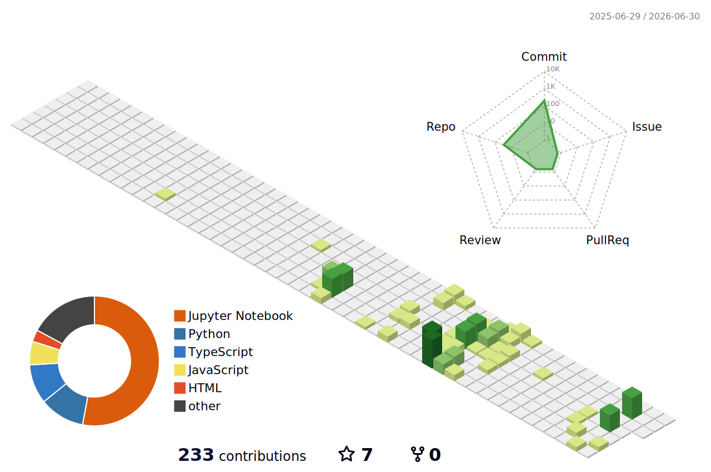

<div align="center">

# Hi 👋 I'm Nithya

### AI & Machine Learning Engineer • GenAI Explorer • Builder


</div>


goal        : Become an AI Engineer
<div align="left">

```yaml
name        : Nithya
role        : AI & Machine Learning Student
college     : Sethu Institute of Technology
location    : Tamil Nadu, India
currently   :
  - DSA for Placements
  - Generative AI
  - Django & FastAPI
  - Cloud Fundamentals
```
</div>

> *"Code is poetry — write it beautifully."*


##  Tech Stack


<div align="center">

| # | Category | Icons |
|---|---|---|
| 🔤 | **Languages** | [](#) |
| 🎨 | **Frontend** | [](#) |
| ⚙️ | **Backend** | [](#) |
| 🚀 | **DevOps** | [](#) |
| 🧰 | **Tools** | [](#) |
| 🎯 | **Other** | [](#) |

</div>


##  GitHub Stats


<div align="center">

[](https://git.io/streak-stats)


</div>


##  3D Contribution Map

<div align="center">

<picture>
    <source media="(prefers-color-scheme: dark)" srcset="./profile-3d-contrib/profile-night-green.svg" />
    
  </picture>

</div>


##  Contribution Graph

<div align="center">

[](https://github.com/ashutosh00710/github-readme-activity-graph)

</div>


##  contributions 
<div align="center">
  <picture>
    <source media="(prefers-color-scheme: dark)" srcset="https://raw.githubusercontent.com/mrhx01/mrhx01/output/github-contribution-grid-snake-dark.svg">
    
  </picture>
</div>


##  Quote

<div align="center">

</div>


</div>


